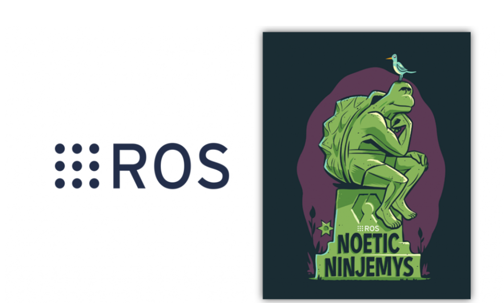

# ROS Lesson

<!--img src="https://github.com/Theara-Seng/ros_lesson/tree/commands/image/ros_noetic.png" width="100" height="100"-->

* ### Go to linux_command folder and understand the basic command of linux

* ### Go to ROS_Installation and install the ROS Noetic on UBUNTU 20.04

* ### Go to Configure_environment_and_workspace Folder and configure following the readme.

* ### Go to ros_architecture to learn basic of topic, node, and message

* ### Go to Create_Message to learn how to create a custom message
